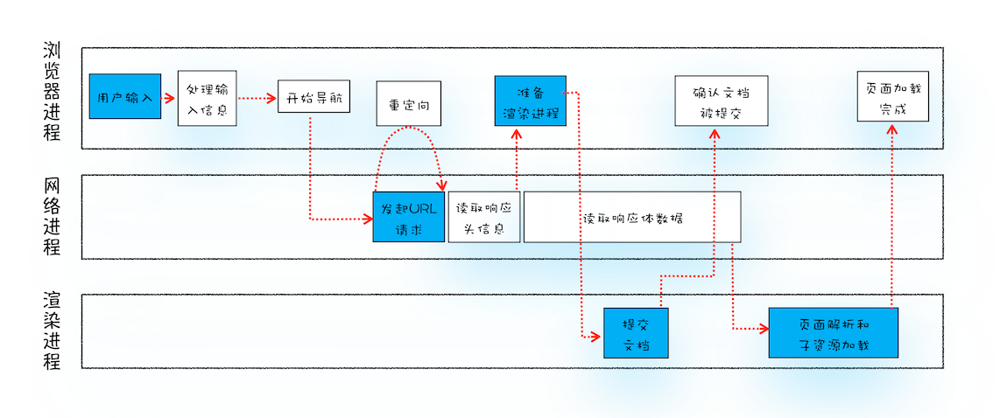

# 输入 URL 之后浏览器做了什么？

---

**前言：**

最近业务上需要对网站进行优化，而优化需要分析哪些点需要优化。网上也看到不少的优化策略，但这也需要根据具体出现的问题单独分析。于是乎“问题少年“的我产生了诸多浏览器的问题，经过一段时间地学习和整理，诞生此篇总结文章，以便理清思路和知识点。

---

首先我们先来看这个问题：输入 URL 之后浏览器做了什么？从呈现出来的现象可以看出，当我们输入 URL 敲回车之后，浏览器 Tab 页标题旁出现转圈，然后页面开始出现并不断更新出一些元素，加载完毕转圈消失。那作为前端程序员则需要知道它背后经历了何种操作才有了我们看到的页面。
总结中会涉及到进程之间的配合：

- 浏览器进程主要负责用户交互、子进程管理和文件储存等功能。
- 网络进程是面向渲染进程和浏览器进程等提供网络下载功能。
- 渲染进程的主要职责是把从网络下载的 HTML、JavaScript、CSS、图片等资源解析为可以显示和交互的页面。因为渲染进程所有的内容都是通过网络获取的，会存在一些恶意代码利用浏览器漏洞对系统进行攻击，所以运行在渲染进程里面的代码是不被信任的。这也是为什么 Chrome 会让渲染进程运行在安全沙箱（sandBox）里，就是为了保证系统的安全。
  我们将其分为两个流程来解析： 导航流程 => 渲染流程

---

- 导航流程

  1.  用户输入
      将用户输入的搜索内容拼接到 URL 中、或者直接请求 URL，页面执行 beforeunload（允许页面退出之前执行数据清理操作，也可询问用户是否离开当前页面等操作）
  2.  构造请求

  输入 URl 地址后，浏览器会构造请求行 （`GET /index.html HTTP/1.1`）、请求头（浏览器信息）准备发给服务器。

  3.  查找缓存

  在发送之前还会去浏览器缓存中查找是否有该请求文件（强缓存、协商缓存），有则直接加载，无则发送 HTTP 请求。此时浏览器进程通过进程间通信（IPC）把 URL 请求发送至网络进程，网络进程收到之后会发起真正的 URL 请求流程。至此页面进程至网络进程阶段。

  4. 准备 IP 地址和端口 （为 TCP 请求做准备）
     首先回顾一下我们输入的 URL 一般都是域名，而请求传输的数据包是通过 IP 地址传输给接收方，加上 IP 地址一般难记，所以便有了这套域名映射系统：DNS ，发请求会去 DNS 中找对应的 IP，当然浏览器和会对解析过的地址进行缓存，这样可减少网络请求。URl 未指明端口则默认为 80 端口。
  5. 等待 TCP 队列
     HTTP/1.1 协议时，一个 TCP 连接同时只能处理一个请求，一个域名最多维护 6 个 TCP 连接，而 HTTP/2.0 则可以并行请求资源，同个域名下只维护 1 个 TCP 连接（Network 下的 ConnectionId 可看出）。

  6. 建立 TCP 连接 1. 三次握手 2. 发送数据 3. 是否保持连接继续传输数据？ 4. 四次挥手（数据发送完毕）
  7. 发送 HTTP 请求
     
     > 1. 将之前构造的请求发送，等待服务器响应。返回的响应头中其 Content-Type 如果为 application/octet-stream（数据为字节流类型），浏览器会按照下载类型处理，将该请求提交给浏览器的下载器，同时导航结束。如果页面为 HTML，则继续导航流程。
     > 2. 解析完响应头数据，将数据转发给浏览器进程。浏览器收到数据，会发送“提交导航“消息给渲染进程。
     > 3. 渲染进程收到消息后，便开始接受 HTML 数据，接受数据方式是直接和网络进程建立数据管道。
     > 4. 渲染进程根据是否同一站点（相同的协议和根域名），决定是否复用渲染进程。
     > 5. 渲染进程会向浏览器进程”确认提交“，表示准备好接收和解析页面数据了。
     > 6. 浏览器进程接收到”确认提交“消息后，便开始移除之前的旧文档，然后更新浏览器中的页面状态。

---

- 渲染流程
  在浏览器进程地协调下，网络进程读取接收到的数据会被渲染进程进行解析和加载，正式进入渲染阶段。

  - 构建 DOM 树（浏览器无法直接理解和使用 HTML）
  - 样式计算（Recalculate Style）
    1. 把 CSS 转换为浏览器能够理解的结构（styleSheets）
    2. 转换样式表中的属性值，使其标准化（2em、blue、bold => 32px、rgb(0,0,255)、font-weight: 700）
    3. 计算出 DOM 树中每个节点的具体样式（CSS 继承规则：每个 DOM 节点都包含有父节点的样式和层叠规则：一个定义了如何合并来自多个源的属性值的算法）
  - 布局阶段 1. 构成布局树（ DOM + CSSOM）
    遍历 DOM Tree 把可见节点加到布局树中，而不可见的（比如 display：none）节点忽略。 2. 布局计算
    节点的坐标位置 3. 分层
    为了处理一些复杂的 3D 变换、页面滚动、Z 轴排序，渲染引擎需要为特定节点生成专用的图层，并生成一颗对应的图层树。（可在 Chrome 开发者工具中的 Layers 查看）。

    生成条件：

    1.  拥有层叠上下文属性的元素会被提升为单独的一层。（明确定位、透明属性、CSS 滤镜）
    2.  需要剪裁（clip）的地方也会被创建为图层。
    3.  图层绘制将图层按照指令顺序生成绘制列表
    4.  栅格化（raster）操作 使用合成线程完成操作，通过视口附近的图块优先生成位图，该操作由栅格化完成，而栅格化的地方是渲染进程专门维护的一个线程池（ performce 可以看到 raster task），而 raster task 通过 GPU 处理图块 => 位图的过程（快速栅格化），并保存在 GPU 的内存中。
    5.  合成和显示
        当所有图块被光栅化，合成线程就会生成一个绘制图块的命令-“DrawQuad“，然后提交给浏览器进程，浏览器收到之后，将页面内容绘制到内存中，最后显示在屏幕上。

Q & A

1. Q：浏览器缓存地方的选择？ From Disk or From memory or service worker cache？
   A：首先附上浏览器缓存流程图

   由图可知，当强缓存命中或者协商缓存命中服务器返回 304 的时候，是从缓存中直接获取资源。
   按照缓存位置的优先级排列：

- Service Worker
  借鉴 web worker 的思路，js 运行在主线程之外，脱离浏览器无法访问 DOM ，但可以实现离线缓存、消息推送、网络代理等功能，PWA 就是依靠其实现。
- Memory Cache（内存缓存）
  特点：效率快、存活时间短（渲染进程结束，内存缓存就不存在了）
- Disk Cache（磁盘中的缓存）
  特点：效率慢、存储容量和时长较内存缓存好。

- Push Cache（推送缓存）：HTTP/2.0

缓存策略：

- 比较大的 JS、CSS 文件会直接被丢进磁盘，反之丢进内存

- 内存使用率比较高的时候，文件优先进入磁盘

1.  Q：TCP 是如何保证重传机制和数据包的排序功能和数据传输的可靠性（相比于 UDP 的三大特性之一）？

    A：

- 重传机制：机制：当发送端发送数据包时会给每个数据包一个序列号，接收端收到时会返回一个确认信号（ACK = 序列号 + 数据包大小 + 1 ），当发送端或接收端未收到相应的确认信号或者数据包时，TCP 发送数据时会设置一个定时器，未收到 ACK 便会重发数据。因为重传机制，所以若发送方发送数据太快，导致接收方来不及接收和处理，所以加入了滑动窗口来避免（流量控制），而如果网络出现拥堵，发送的数据包出现丢包，那这样会触发很多包重传，然后发了之后又可能出现丢包，这样不断滚雪球，所以 TCP 采用拥塞控制（慢启动、）
- 排序功能：TCP 头除了包含目标端口号和本机端口号，还提供了用于排序的序列号，以便重排数据包
- 数据传输可靠性：（有状态、可控制）
- 有状态：
  - TCP 会记录数据的状态（被发送、被接收）：报文头部的确认号（ACK）用于告知对方下一个要接收的序列号，小于 ACK 的表示已经被接收了。为了维护状态， TCP 将 IP 变成字节流，所以其是面向字节流的。
  - （UDP 则是面向数据报的，其仅仅继承了 IP 层的特性）
    保证数据包按序到达：通过其报文头部的序列号（sequence number），在对端确认时（需要发送 SYN（在建立连接时创建，用于同步序号）即在三次握手的前两次握手会传输），需要消耗序列号，这就是为什么
- 可控制：重传机制

2.  Q：四次挥手最后等待 2MSL 是什么？为什么会等待 2MSL？

    A：

- 1 个 MSL 确保四次挥手中主动关闭方最后的 ACK 报文最终能达到对端

- 1 个 MSL 确保对端没有收到 ACK 重传的 FIN 报文可以到达

- 等待 2MSL 的意义：等待是为了看服务端是否未收到而发回重发请求，这个我们可以类比为某宝收货后评价的功能，若确认收货后，用户一直没给评价，那么系统就会默认设置为好评。

3. Q：为什么四次挥手而不是三次？

   A：三次挥手意味着服务端会将 FIN 和 ACK 一并传给客户端，但有个问题就是服务端发送 FIN 是需要其把自己要传的东西都传完才会去发送自己要断开的信号，所以这个时候 FIN 和 ACK 若要一起发的话，肯定要等待服务端数据发送完毕，此时客户端一直没收到 ACK，就会误以为自己发的 FIN 服务端未收到，就会重发 FIN。

4. Q：TFO 解决了什么？
5. Q：如果下载 CSS 文件阻塞了，会阻塞 DOM 树的合成吗？会阻塞页面的显示吗？

   A: CSS 在 JS 需要访问某个元素的样式，需要等待这个样式被下载完成之后才能继续往下执行的这种情况下会阻塞 DOM 的解析，会阻塞页面的显示，因为其资源被阻塞，计算样式需要等待资源进行层叠样式，请求失败之后，网络超时，渲染进程继续渲染层叠样式计算(相应的用浏览器自带样式代替)

6. Q： CSS 解析会阻塞 DOM 渲染吗？

   A：会间接阻塞，如果代码里引用了外部的 CSS 文件，那么在执行 JavaScript 之前，还需要等待外部的 CSS 文件下载完成，并解析生成 CSSOM 对象之后，才能执行 JavaScript 脚本。但是不会阻塞 DOM 树解析，因为两者是并行的。

7. Q：为了避免强制同步布局，我们可以调整策略，在修改 DOM 之前查询相关值，但是修改之前查询的 DOM 值只是修改之前的啊，我要查询修改之后的不还是得放到后面？

   A：一般都不需要先修改然后再读区元素的样式属性值，所以上一帧的值就足够了。过早地同步执行样式计算和布局是潜在的页面性能的瓶颈之一。为什么我们一般只需要上一帧的值就足够了？

8. Q：只要传输层是 TCP，队头阻塞问题就无法解决，HTTP/2.0 只是缓解？

   A：因为从协议角度来说，TCP 的诸多举措都是围绕着发包，HTTP/2.0 只是优化了发包的措施， 将包编号，最终在接收端进行排序，但是此时若一个包出现丢包现象，此时接收端依旧无法组合数据，产生堵塞。

9. Q：而 HTTP/2 便从 HTTP 协议本身解决了队头阻塞问题。注意，这里并不是指的 TCP 队头阻塞，而是 HTTP 队头阻塞，两者并不是一回事。TCP 的队头阻塞是在数据包层面，单位是数据包，前一个报文没有收到便不会将后面收到的报文上传给 HTTP，而 HTTP 的队头阻塞是在 HTTP 请求-响应层面，前一个请求没处理完，后面的请求就要阻塞住。两者所在的层次不一样？

   A：

10. Q: 为什么加载页面时会出现刚开始模糊，后面页面变清晰的现象？

    A：考虑到浏览器内存上传到 GPU 内存的操作比较慢，即使是绘制一部分图块，也可能会耗费大量时间。针对这个问题，Chrome 采用了一个策略: 在首次合成图块时只采用一个低分辨率的图片，这样首屏展示的时候只是展示出低分辨率的图片，这个时候继续进行合成操作，当正常的图块内容绘制完毕后，会将当前低分辨率的图块内容替换。这也是 Chrome 底层优化首屏加载速度的一个手段。
